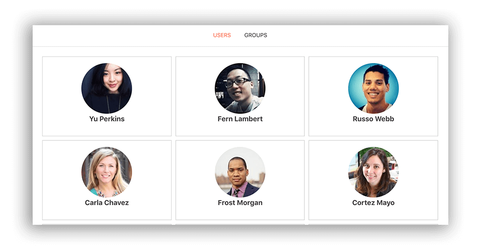

# React Next Example

This a sample API that uses React@next (16.6.2) to create a similar architecture as Redux using `React.Context` and `React.useReducer`.

Read more about it in my blog post entry: [Replacing Redux with React's useReducer and Context](http://jonalvarezz.com/articles/replacing-redux-with-usereducer-context/)

Also features:

- React Hooks
- React Context
- Styled Components
- React Spring
- Prettier

Todo:
- [ ] Use Routing.
- [ ] Code Split with React Lazy and Suspense.

## Available Scripts

In the project directory, you can run:

### `yarn`

Installs project dependencies

### `yarn start`

Runs the app in the development mode. 
Open [http://localhost:3000](http://localhost:3000) to view it in the browser.

The page will reload if you make edits. 
You will also see any lint errors in the console.

### `yarn test`

Launches the test runner in the interactive watch mode. 
See the section about [running tests](https://facebook.github.io/create-react-app/docs/running-tests) for more information.

### `yarn build`

Builds the app for production to the `build` folder. 
It correctly bundles React in production mode and optimizes the build for the best performance.

The build is minified and the filenames include the hashes. 
Your app is ready to be deployed!

See the section about [deployment](https://facebook.github.io/create-react-app/docs/deployment) for more information.

This project was bootstrapped with [Create React App](https://github.com/facebook/create-react-app).
